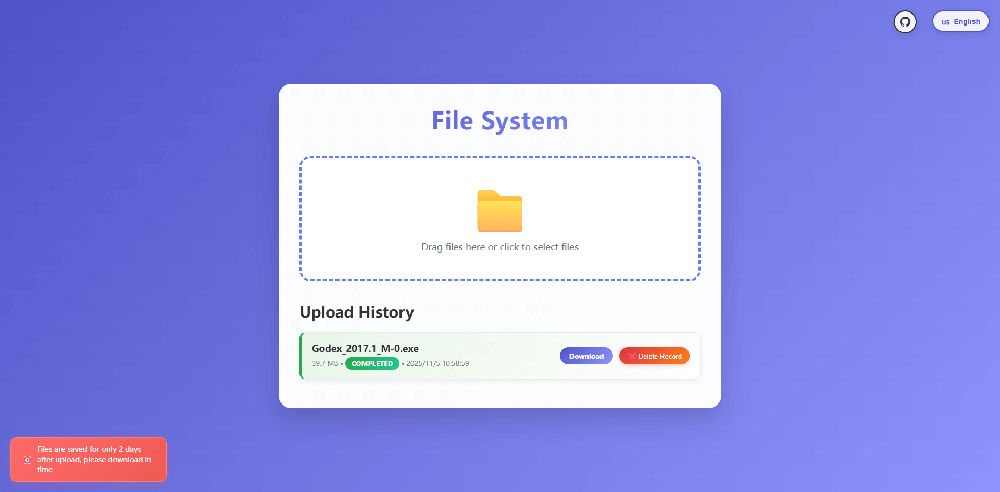

# MinIO File Upload Server

A powerful file upload server based on Express.js and MinIO, designed for modern web applications with enterprise-grade features including large file chunked uploads, resumable uploads, multi-language interface, and more.

## Screenshots



## ✨ Core Features

### 🚀 File Upload Capabilities
- **Large File Chunked Upload** - Stable upload support for GB-level files
- **Resumable Upload** - Resume uploads from breakpoints after network interruptions
- **Drag & Drop Upload** - Intuitive drag-and-drop file upload experience
- **Batch Upload** - Support for simultaneous multiple file uploads
- **Real-time Progress** - Display upload speed, progress percentage, and remaining time
- **Auto Retry** - Automatic retry mechanism for upload failures

### 🎨 User Interface
- **Responsive Design** - Perfect adaptation for desktop, tablet, and mobile
- **Modern UI** - Gradient colors and smooth animations
- **Multi-language Support** - Chinese and English interface switching
- **Dark Theme** - Eye-friendly dark interface option
- **Touch Optimization** - Mobile-friendly touch interactions

### 📊 Data Management
- **Upload History** - Local storage of upload records
- **File Management** - View, download, and delete uploaded files
- **Status Tracking** - Real-time display of upload status (uploading/completed/failed)
- **Storage Reminders** - File save期限 reminders

### 🔒 Security Features
- **File Validation** - File type and size validation
- **Temporary Storage** - Automatic file cleanup
- **Access Control** - MinIO key-based access control
- **HTTPS Support** - Secure transmission for production environments

## 🚀 Quick Start

### Requirements

- Node.js 14.0 or higher
- MinIO server
- Modern browsers (Chrome 80+, Firefox 75+, Safari 13+)

### 1. Clone Project

```bash
git clone https://github.com/your-username/minio-server.git
cd minio-server
```

### 2. Install Dependencies

```bash
npm install
```

### 3. Configure Environment Variables

Create `.env` file:

```env
# MinIO Configuration
MINIO_ENDPOINT=localhost
MINIO_PORT=9000
MINIO_ACCESS_KEY=your-access-key
MINIO_SECRET_KEY=your-secret-key
MINIO_BUCKET=temporary-files
MINIO_USE_SSL=false

# Server Configuration
PORT=3000
NODE_ENV=development

# File Configuration
MAX_FILE_SIZE=1073741824  # 1GB
CHUNK_SIZE=5242880       # 5MB
FILE_EXPIRY_DAYS=2       # 2 days
```

### 4. Start Server

```bash
# Development mode (hot reload)
npm run dev

# Production mode
npm start

```

### 5. Access Application

Open browser and visit `http://localhost:3000`

## 📚 API Documentation

### Chunked Upload Process

#### 1. Initialize Chunked Upload

```http
POST /api/upload/init
Content-Type: application/json

{
  "fileName": "large-file.mp4",
  "fileSize": 1073741824,
  "chunkSize": 5242880,
  "totalChunks": 205,
  "fileType": "video/mp4"
}
```

**Response:**
```json
{
  "success": true,
  "uploadId": "uuid-upload-id",
  "chunkSize": 5242880,
  "totalChunks": 205
}
```

#### 2. Upload Chunk

```http
POST /api/upload/chunk
Content-Type: multipart/form-data

uploadId: uuid-upload-id
chunkIndex: 0
chunk: [binary file data]
```

**Response:**
```json
{
  "success": true,
  "chunkIndex": 0,
  "uploaded": true,
  "progress": 0.49
}
```

#### 3. Complete Upload

```http
POST /api/upload/complete
Content-Type: application/json

{
  "uploadId": "uuid-upload-id",
  "fileName": "large-file.mp4",
  "totalChunks": 205
}
```

**Response:**
```json
{
  "success": true,
  "objectName": "uuid-large-file.mp4",
  "url": "/files/uuid-large-file.mp4",
  "message": "File upload completed"
}
```

### Other API Endpoints

#### Cancel Upload
```http
DELETE /api/upload/:uploadId
```

#### Get Upload Status
```http
GET /api/upload/:uploadId/status
```

#### Single File Upload (Small Files)
```http
POST /api/upload/single
Content-Type: multipart/form-data

file: [file data]
```

#### Get File List
```http
GET /api/files?page=1&limit=20
```

#### Download File
```http
GET /api/files/:objectName/download
```

#### Delete File
```http
DELETE /api/files/:objectName
```

## 🏗️ Project Structure

```
minio-server/
├── package.json              # Project dependencies and scripts
├── package-lock.json         # Lock dependency versions
├── server.js                 # Express server main file
├── index.html                # Frontend upload interface
├── .env                      # Environment variables configuration
├── .env.example              # Environment variables example
├── .gitignore               # Git ignore file
├── README_CN.md             # Chinese documentation
├── README.md                # English documentation
├── node_modules/            # Node.js dependencies
└── logs/                    # Log files directory
    ├── access.log           # Access logs
    ├── error.log            # Error logs
    └── upload.log           # Upload logs
```

## 🛠️ Tech Stack

### Backend Technologies
- **Express.js** - Fast, minimalist web framework
- **MinIO** - High-performance object storage service
- **Multer** - File upload middleware
- **UUID** - Generate unique identifiers
- **Helmet** - Security middleware
- **CORS** - Cross-Origin Resource Sharing

### Frontend Technologies
- **Vanilla JavaScript (ES6+)** - Modern JavaScript features
- **HTML5** - Semantic markup
- **CSS3** - Modern styles and animations
- **IndexedDB** - Browser local database
- **Fetch API** - Modern HTTP requests
- **Service Worker** - Offline support

## 🔧 Development Guide

### Local Development

1. **Install Development Dependencies**
   ```bash
   npm install --dev
   ```

2. **Start Development Server**
   ```bash
   npm run dev
   ```

### Production Deployment

1. **Start Production Server**
   ```bash
   npm start
   ```

2. **Manage Process with PM2**
   ```bash
   pm2 start server.js --name minio-server
   ```

### Docker Deployment

```dockerfile
FROM node:16-alpine

WORKDIR /app

COPY package*.json ./
RUN npm ci --only=production

COPY . .

EXPOSE 3000

CMD ["npm", "start"]
```

```bash
# Build image
docker build -t minio-server .

# Run container
docker run -p 3000:3000 --env-file .env minio-server
```

## 📝 Usage Examples

### JavaScript Client Example

```javascript
// Initialize upload
const initUpload = async (file) => {
  const response = await fetch('/api/upload/init', {
    method: 'POST',
    headers: {
      'Content-Type': 'application/json'
    },
    body: JSON.stringify({
      fileName: file.name,
      fileSize: file.size,
      chunkSize: 5242880
    })
  });
  
  return await response.json();
};

// Upload chunk
const uploadChunk = async (uploadId, chunkIndex, chunk) => {
  const formData = new FormData();
  formData.append('uploadId', uploadId);
  formData.append('chunkIndex', chunkIndex);
  formData.append('chunk', chunk);
  
  const response = await fetch('/api/upload/chunk', {
    method: 'POST',
    body: formData
  });
  
  return await response.json();
};
```

### cURL Examples

```bash
# Initialize upload
curl -X POST http://localhost:3000/api/upload/init \
  -H "Content-Type: application/json" \
  -d '{"fileName":"test.pdf","fileSize":1048576,"chunkSize":524288}'

# Upload chunk
curl -X POST http://localhost:3000/api/upload/chunk \
  -F "uploadId=uuid-here" \
  -F "chunkIndex=0" \
  -F "chunk=@chunk_0.bin"

# Complete upload
curl -X POST http://localhost:3000/api/upload/complete \
  -H "Content-Type: application/json" \
  -d '{"uploadId":"uuid-here","fileName":"test.pdf","totalChunks":2}'
```


## 📄 License

This project is licensed under the MIT License. See the [LICENSE](LICENSE) file for details.

## 🙏 Acknowledgments

Thanks to the following open source projects:
- [Express.js](https://expressjs.com/) - Web framework
- [MinIO](https://min.io/) - Object storage
- [Multer](https://github.com/expressjs/multer) - File upload
